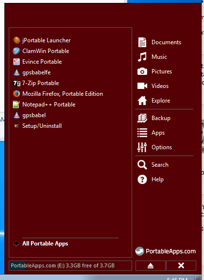

osm_stick
=========

MS Windows Portable App [0] USB for OSM Editing.

Portable Apps included:
----------------------------
* JOSM including a few plugins
* GPSBabel
* QGIS 2.0 (todo)
* PDF reader
* Firefox or Chrome
* 7-Zip
* ClamWin
* Notepad++
* Learning materials (todo)
* Installers (todo)

How to use
---------------------
1. Download this repo [1] and extract all the contents in a USB flashdisk.
2. Stick in your USB flashdisk.
3. In your file manager, open the USB Flashdisk and click ```g:\Start.exe```.
   The PortableApps menu will appear.



4. Click on any application to run them.
5. To run JOSM, select ```jPortable Launcher```.  Choose the ```josm-tested.jar```,
   (for example,  at ```g:\PortableApps\JOSM\josm-tested.jar```).
6. JOSM should start up as usual. 


References
------------------------
[0] http://portableapps.com

[1] https://github.com/essc/osm_stick/